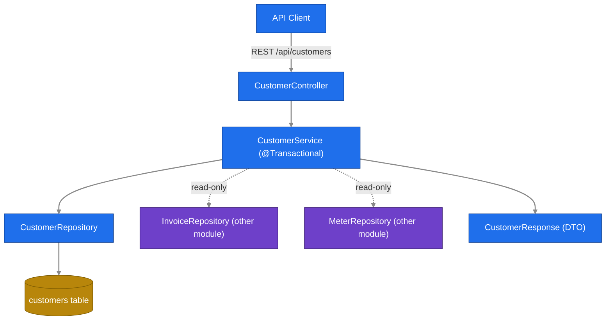
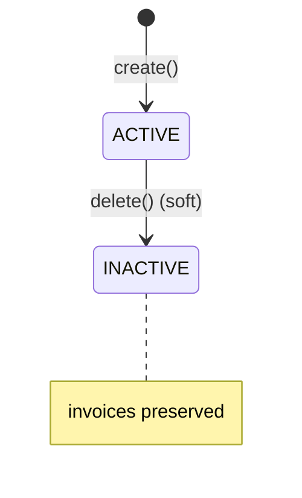

# Customer Module Analysis — EcoVolt Billing

> Scope: `billing-service/src/main/java/com/ecovolt/billing/customer/**` and
> `billing-service/src/test/java/com/ecovolt/billing/customer/**`.
> Cross-module names (meter, invoice, common, exception) are referenced only where customer
> code/tests depend on them; their internals are out of scope.

## 1. Business Logic Overview

The customer module owns **customer master data** — the people/accounts billed for electricity.
It is the entry point for onboarding a customer and the system-of-record for their identity and
contact details (`Customer.java:42-58`). Each customer carries a stable, externally meaningful
**customer number** and a lifecycle **status** (`CustomerStatus.java:3-7`).

Domain rules recovered:
- A customer is **created in `ACTIVE` status** automatically; status is never client-supplied at create (`CustomerService.java:37`).
- Every customer receives a **unique, system-generated customer number** prefixed `CUST-`; uniqueness is guaranteed by retrying generation until unused (`CustomerService.java:93-99`, uniqueness constraint `Customer.java:29-30`, `CustomerRepository.java:7`).
- **Deletion is soft** — a "delete" request **deactivates** (status → `INACTIVE`) rather than removing the record, preserving billing history (`CustomerService.java:65-70`, verified by `CustomerRetentionIntegrationTest.java:67-74`).
- Updates may change **name, email, phone, address** but **never** customer number or status (`CustomerService.java:54-63`; customer number is `updatable = false`, `Customer.java:42`).

Stakeholder "why": preserving invoices on deactivation protects financial/audit history of a
billed account (test name: "Deleting a customer with billing history deactivates and preserves
invoices", `CustomerRetentionIntegrationTest.java:38`).

## 2. Architecture Overview

Standard layered Spring Boot slice: REST controller → service (transaction boundary) → JPA
repository → entity. The module is **self-contained for writes** but acts as a **read aggregator**
for related meters and invoices by delegating to their repositories
(`CustomerService.java:25-27, 72-82`).

## 3. Components / Subcomponents

| Component | Responsibility | Evidence |
|-----------|----------------|----------|
| `Customer` | JPA entity / aggregate root; owns meters & invoices collections | `Customer.java:36-66` |
| `CustomerStatus` | Lifecycle enum: ACTIVE, INACTIVE, SUSPENDED | `CustomerStatus.java:3-7` |
| `CustomerRepository` | Persistence + `existsByCustomerNumber` uniqueness check | `CustomerRepository.java:5-8` |
| `CustomerService` | Business logic, transaction boundary, cross-module reads | `CustomerService.java:23-99` |
| `CustomerController` | REST endpoints under `/api/customers` | `CustomerController.java:27-80` |
| `CustomerRequest` | Inbound DTO with validation constraints | `dto/CustomerRequest.java:8-24` |
| `CustomerResponse` | Outbound DTO + mapping from entity | `dto/CustomerResponse.java:10-32` |

## 4. Interface Definitions (REST)

All under base path `/api/customers` (`CustomerController.java:28`):

| Method | Path | Behavior | Status | Evidence |
|--------|------|----------|--------|----------|
| POST | `/` | Create customer | 201 Created | `CustomerController.java:35-39` |
| GET | `/` | List customers, paged (default size 20, sort id asc) | 200 | `:41-45` |
| GET | `/{id}` | Get customer by id | 200 / 404 | `:47-51` |
| GET | `/{id}/invoices` | List customer's invoices, paged | 200 / 404 | `:53-59` |
| GET | `/{id}/meters` | List customer's meters, paged | 200 / 404 | `:61-67` |
| PUT | `/{id}` | Update mutable fields | 200 / 404 | `:69-73` |
| DELETE | `/{id}` | Deactivate (soft delete) | 204 No Content | `:75-80` |

404 path: missing customer raises `ResourceNotFoundException("Customer","id",id)`
(`CustomerService.java:88-91`).

## 5. Data Contracts

**CustomerRequest** (inbound, `dto/CustomerRequest.java:8-24`):
- `name` — required, ≤120 chars (`:10-12`)
- `email` — required, valid email format (`:14-16`)
- `phone` — optional; pattern empty OR 7–15 chars of digits/`+`/`-`/space (`:18-20`)
- `address` — optional, ≤500 chars (`:22-23`)

**CustomerResponse** (outbound, `dto/CustomerResponse.java:10-32`): exposes id, customerNumber,
name, email, phone, address, status, plus audit `createdAt`/`updatedAt` (sourced from
`BaseEntity`, `common/BaseEntity.java:25-31`). Note `customerNumber` and `status` are
**response-only** — not accepted from clients.

## 6. Relationships

- `Customer` 1—* `Meter` (`mappedBy="customer"`, cascade ALL, orphanRemoval, LAZY) — `Customer.java:60-62`.
- `Customer` 1—* `Invoice` (`mappedBy="customer"`, cascade ALL, LAZY, **no orphanRemoval**) — `Customer.java:64-66`.
- Extends `BaseEntity` for auditing + optimistic-lock version (`Customer.java:36`, `common/BaseEntity.java:23-35`).
- Service depends on `InvoiceRepository` and `MeterRepository` for read aggregation (`CustomerService.java:26-27`).

The orphanRemoval difference is domain-meaningful: detaching a meter removes it, but invoices are
retained as financial records.

## 7. Validation & Invariants

- Input validation enforced at controller via `@Valid` (`CustomerController.java:37,71`) against `CustomerRequest` constraints (§5).
- DB-level invariants: `customer_number` unique & non-updatable; `name`, `email`, `status` non-null (`Customer.java:29-30,42-58`).
- Customer-number uniqueness double-guarded: generation loop (`CustomerService.java:93-99`) + DB unique constraint.
- Existence precondition: read/update/delete all funnel through `getCustomerOrThrow` (`CustomerService.java:50-91`).

## 8. State / Lifecycle Behavior

`CustomerStatus` is an explicit state machine (`CustomerStatus.java:3-7`):

Observed transitions in code: `→ACTIVE` on create (`CustomerService.java:37`), `→INACTIVE` on
delete (`CustomerService.java:68`). **`SUSPENDED` is declared but never assigned or transitioned**
anywhere in scope — see Anomalies. No reactivation path exists in the module.

## 9. Integration Patterns

- **Read aggregation across modules**: customer endpoints surface a customer's invoices and meters by delegating to those repositories after confirming the customer exists (`CustomerService.java:72-82`).
- **Shared lookup contract**: `getCustomerOrThrow` is documented as the resolver "used by other modules (meter, invoice)" (`CustomerService.java:84-91`) — the module exposes itself as a customer-resolution service.
- **Structured logging** for lifecycle events: `customer_created`, `customer_updated`, `customer_deactivated` (`CustomerService.java:40,61,69`).

## 10. Quality Observations

- Update relies on JPA dirty-checking inside `@Transactional` — no explicit `save()` in `update` (`CustomerService.java:54-63`); correct but implicit.
- Pagination consistently defaulted (size 20, sort id asc) across list endpoints (`CustomerController.java:43,57,65`).
- Optimistic locking via `@Version opt_lock` inherited from `BaseEntity` (`common/BaseEntity.java:33-35`).
- Test coverage is thin: a single integration test covers only the soft-delete/retention path (`CustomerRetentionIntegrationTest.java:37-75`); create/update/validation/404 paths are not directly tested in scope.

## 11. Engineering Insights

- The soft-delete-as-deactivation choice is the module's most important domain decision and is the only behavior explicitly pinned by a test, signalling it as a key business rule (retention of billing history).
- The module is the identity hub of the domain: meters and invoices hang off it, and it offers a shared resolver, making it a high-fan-in dependency.

## 12. Assumptions & Unknowns

- **SUSPENDED unused (anomaly)**: enum value defined (`CustomerStatus.java:6`) but no transition assigns it within scope. Could be future/external use or dead value — *unverified* (out-of-scope modules not inspected).
- **Reactivation**: no INACTIVE→ACTIVE path found in scope; assumed intentionally absent — *unverified*.
- `Meter`, `Invoice`, `InvoiceRepository`, `MeterRepository`, `ResourceNotFoundException`, `BaseEntity` internals are referenced by name only; their behavior is assumed from usage, not analyzed (out of scope).
- Authn/authz, error-to-HTTP mapping (e.g., 404 translation) handled outside the module (no handler in customer package) — *assumed global*.

## 13. Out-of-Scope Exclusions

Meter, reading, invoice, and tariff internals were **not** analyzed. They appear here only as named
dependencies proven by customer source/tests (`Customer.java:5-6`, `CustomerService.java:7-10`,
`CustomerRetentionIntegrationTest.java:3-10`).
