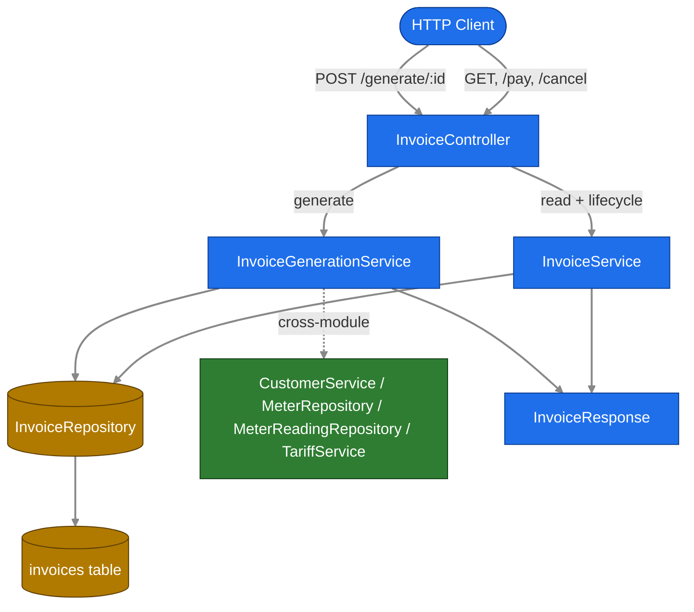
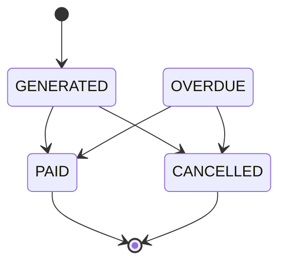

# Invoice Module Analysis

Scope: `billing-service/src/main/java/com/ecovolt/billing/invoice/**` and
`billing-service/src/test/java/com/ecovolt/billing/invoice/**`. Cross-module types are
referenced only where visible from invoice code. All paths are repo-relative.

## Business Logic Overview

The invoice module turns consecutive meter readings into billable invoices and manages each
invoice's payment lifecycle. The core rule: for each customer meter holding at least two
readings, take the latest two readings *from that same meter*, compute consumption as
`current - previous`, apply the meter's tariff, and persist one invoice
(`InvoiceGenerationService.java:41-119`). Readings never cross meters
(`InvoiceGenerationService.java:51-61`). Source-reading pairs are deduplicated so the same pair
is never billed twice (`InvoiceGenerationService.java:64-67`; DB-enforced at `Invoice.java:34-37`).

Two stakeholder-visible guards exist: negative consumption is rejected
(`InvoiceGenerationService.java:73-77`), and generation requiring at least two readings vs. all
pairs already invoiced are distinguished as separate failures
(`InvoiceGenerationService.java:105-115`).

## Architecture Overview

The module follows a layered Spring Boot CQRS-style split:
- **Controller** — REST adapter, `/api/invoices` (`InvoiceController.java:21-59`).
- **Write/generation service** — `InvoiceGenerationService.java` owns invoice creation
  (`:24-29` javadoc states the pipeline).
- **Read + lifecycle service** — `InvoiceService.java` owns queries and status transitions
  (`:13-14` javadoc: "Read-side queries... Generation lives in InvoiceGenerationService").
- **Persistence** — `InvoiceRepository.java` (Spring Data JPA) + `Invoice.java` entity.
- **DTO** — `InvoiceResponse.java` record, the only outward-facing shape.

## Components / Subcomponents

| Component | Responsibility | Evidence |
|---|---|---|
| `InvoiceController` | REST endpoints, status codes | `InvoiceController.java:30-59` |
| `InvoiceGenerationService` | Generation pipeline, invoice-number minting | `InvoiceGenerationService.java:41-128` |
| `InvoiceService` | findAll/findById/findByCustomerId, pay, cancel, transition guard | `InvoiceService.java:23-70` |
| `InvoiceRepository` | existence checks + paged customer query | `InvoiceRepository.java:9-14` |
| `Invoice` | JPA entity / aggregate root | `Invoice.java:43-93` |
| `InvoiceStatus` | lifecycle states enum | `InvoiceStatus.java:3-8` |
| `InvoiceResponse` | outward DTO + mapper | `InvoiceResponse.java:10-42` |

## Interface Definitions (REST)

| Method/Path | Behavior | Success | Evidence |
|---|---|---|---|
| `POST /api/invoices/generate/{customerId}` | Generate invoices for customer | `201 CREATED`, body `List<InvoiceResponse>` | `InvoiceController.java:30-35` |
| `GET /api/invoices` | Paged list, default size 20, sort `id ASC` | `200`, `Page<InvoiceResponse>` | `InvoiceController.java:37-41` |
| `GET /api/invoices/{id}` | Fetch one | `200` | `InvoiceController.java:43-47` |
| `POST /api/invoices/{id}/pay` | Mark paid | `200` | `InvoiceController.java:49-53` |
| `POST /api/invoices/{id}/cancel` | Cancel | `200` | `InvoiceController.java:55-59` |

Error mapping is centralized (cross-module, visible via thrown types): `ResourceNotFoundException`
→ `404` and `BillingException` → `422`
(`exception/GlobalExceptionHandler.java:24,29`). Verified by tests asserting `404` semantics
(`InvoiceGenerationIntegrationTest.java:83-86`) and `422`
(`InvoiceLifecycleIntegrationTest.java:104-110`).

## Data Contracts

`InvoiceResponse` exposes IDs (not nested objects) for customer/readings/tariff and flattens
financial fields (`InvoiceResponse.java:10-24`). `tariffPlanId` is null-safe
(`InvoiceResponse.java:37`). Persistent contract on `Invoice`: monetary precision
`amount` `precision=14,scale=2` (`Invoice.java:61-62`); reading/units `precision=12,scale=2`
(`Invoice.java:52-59`); `invoiceNumber` unique & immutable (`Invoice.java:49-50`).
Tariff snapshot fields (`tariffType`, `tariffVersion`) are copied at generation time
(`InvoiceGenerationService.java:91-92`), preserving the tariff applied even if plans change later.

## Relationships

`Invoice` is `@ManyToOne` to `Customer`, two `MeterReading` records (previous/current), and an
optional `TariffPlan` (`Invoice.java:78-92`). The reading FKs are `updatable=false`
(`Invoice.java:83,87`), marking the source pair immutable after creation. The `TariffCalculation`
cross-module contract returns `(amount, tariffPlan)` consumed at `InvoiceGenerationService.java:80-92`
(`tariff/TariffCalculation.java:5-8`).

## Validation Rules

1. Customer must exist — else `ResourceNotFoundException` (`InvoiceGenerationService.java:43`;
   test `InvoiceGenerationIntegrationTest.java:84-86`).
2. A meter needs ≥2 readings to be eligible (`InvoiceGenerationService.java:55-57`).
3. No eligible meter at all → 422 "At least two meter readings"
   (`InvoiceGenerationService.java:105-109`; tests `...ServiceTest.java:176-213`).
4. Duplicate source pair skipped silently in-batch (`InvoiceGenerationService.java:64-67`);
   if all pairs duplicate → 422 "already been invoiced" (`:111-115`;
   test `...ServiceTest.java:219-233`).
5. Negative consumption rejected → 422 "negative consumption"
   (`InvoiceGenerationService.java:73-77`; test `...ServiceTest.java:277-292`).

## State / Lifecycle Behavior

States: `GENERATED, PAID, OVERDUE, CANCELLED` (`InvoiceStatus.java:3-8`). New invoices start
`GENERATED` (`InvoiceGenerationService.java:94`). Transition rule: only from `GENERATED` or
`OVERDUE`, only to `PAID` or `CANCELLED` (`InvoiceService.java:67-70`); invalid transitions throw
`BillingException` (`:59-65`). `PAID`/`CANCELLED` are therefore terminal.

Assumption/unknown: **no code path within this module sets `OVERDUE`** — it is a valid source
state in the guard (`InvoiceService.java:68`) and used in tests (`InvoiceLifecycleIntegrationTest.java:76-79`)
but no transition *into* `OVERDUE` was found in scope. Likely set by an out-of-scope scheduler or
external process (unverified).

## Integration Patterns

Generation orchestrates four cross-module collaborators via constructor injection
(`InvoiceGenerationService.java:35-39`): `CustomerService.getCustomerOrThrow`,
`MeterRepository.findByCustomer_IdOrderByIdAsc`,
`MeterReadingRepository.findTop2ByMeter_IdOrderByReadingDateDescIdDesc`, and
`TariffService.calculateAmount` (`:43,46,52-53,80-81`). Invoice numbers are minted as
`INV-{year}-{8 hex}` with a uniqueness retry loop (`InvoiceGenerationService.java:121-128`).
Structured logging uses `event=...` key-value lines (`:44,100-101,117`; `InvoiceService.java:37,45`).

## Quality Observations

- Clear CQRS-ish separation of generation vs. read/lifecycle (two services) keeps transactions
  focused (`InvoiceService.java:23-47` use `@Transactional`).
- Defense in depth on dedup: app-level check (`:64-67`) plus DB unique constraint
  (`Invoice.java:34-37`) — `DataIntegrityViolation` would map to 409
  (`exception/GlobalExceptionHandler.java:50`).
- Optimistic locking via `@Version optLock` inherited from `BaseEntity`
  (`common/BaseEntity.java:33-35`).
- Test coverage is strong: unit (mocked) `InvoiceGenerationServiceTest.java` (355 lines),
  generation integration `InvoiceGenerationIntegrationTest.java` (261), lifecycle integration
  `InvoiceLifecycleIntegrationTest.java` (135). They assert amounts, selector ordering, dedup
  replay, multi-meter partial duplicates, and endpoint status codes.

## Engineering Insights

- The latest-two selector orders by `readingDate DESC, id DESC`
  (`InvoiceGenerationService.java:52-53`), so ties on date break by id — verified explicitly
  (`...ServiceTest.java:151-152`, `...IntegrationTest.java:170-182`).
- Invoice number generation has a theoretical unbounded loop on UUID collision
  (`InvoiceGenerationService.java:123-126`) — negligible risk; noted, not a defect.
- `generatedDate` uses `LocalDate.now()` per invoice (`InvoiceGenerationService.java:79`),
  making generation timezone/clock dependent (observation, not graded).

## Assumptions & Unknowns

- Transition into `OVERDUE` is **out of scope / not found** in invoice code (see Lifecycle).
- HTTP status codes (404/422/409) are asserted by tests but the mapping lives in
  `exception/GlobalExceptionHandler.java` (referenced cross-module, not analyzed in depth).
- Tariff calculation internals are out of scope; only the `TariffCalculation` contract is used.

## Out-of-Scope Exclusions

Customer, meter, reading, and tariff *internals* were not analyzed. Only their contracts visible
from invoice code (`CustomerService`, `MeterRepository`, `MeterReadingRepository`, `TariffService`,
`TariffCalculation`, entity associations) are referenced.
