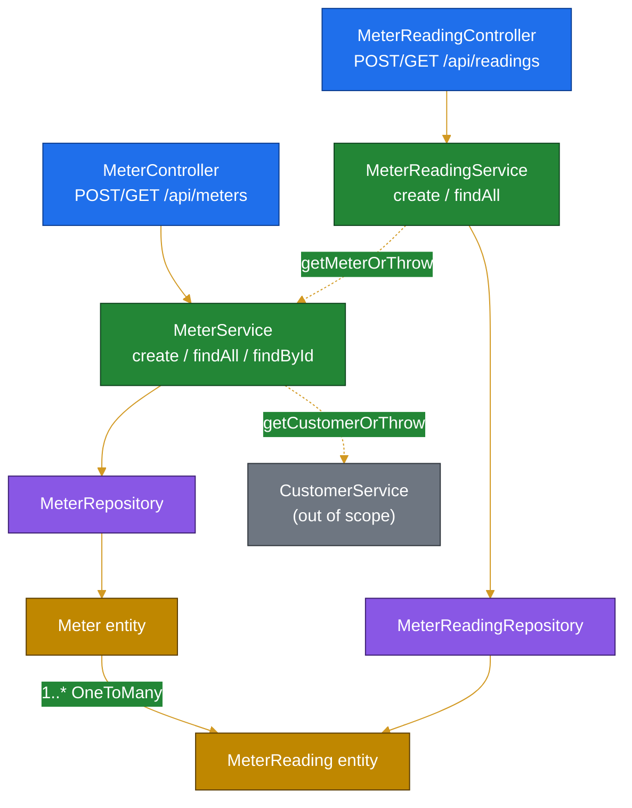

# Module Analysis: Meter & Meter-Reading

> Scope: `billing-service/src/main/java/com/ecovolt/billing/meter/**`, `.../reading/**`, and
> `billing-service/src/test/java/com/ecovolt/billing/reading/**`. Cross-module references
> (customer, tariff, exception, common) cited only where proven from in-scope files.
> All paths relative to repo root. Line ranges point to source-of-truth evidence.

## 1. Business Logic Overview

Two cohesive domains register physical electricity meters and capture their periodic readings.

- **Meter**: a physical device with a globally unique `meterNumber`, an installation date, a
  lifecycle status, a billing tariff classification, and an owning customer
  (`meter/Meter.java:46-63`). New meters are always created `ACTIVE`
  (`meter/MeterService.java:34`) and default to `RESIDENTIAL` tariff when unspecified
  (`meter/MeterService.java:35`, `meter/Meter.java:59`).
- **Meter Reading**: a dated cumulative reading value (`BigDecimal`, scale 2) tied to one meter,
  unique per `(meter, date)` (`reading/MeterReading.java:40-48`, `:26-28`). The domain enforces
  **chronological monotonicity** of reading values — a reading may not be lower than the nearest
  earlier reading nor higher than the nearest later reading (`reading/MeterReadingService.java:33-49`).

The stakeholder-facing intent: meter inventory is trustworthy (unique numbers, valid install
dates) and consumption data is internally consistent (no duplicates, no physically impossible
backward consumption) so downstream billing can compute usage deltas safely.

## 2. Architecture Overview

Classic Spring Boot layered slices, one per domain, mirrored structurally:

| Layer | Meter | Reading |
|---|---|---|
| REST Controller | `meter/MeterController.java` | `reading/MeterReadingController.java` |
| Service (txn boundary) | `meter/MeterService.java` | `reading/MeterReadingService.java` |
| Repository (Spring Data JPA) | `meter/MeterRepository.java` | `reading/MeterReadingRepository.java` |
| Entity | `meter/Meter.java` | `reading/MeterReading.java` |
| DTOs (records) | `meter/dto/*` | `reading/dto/*` |

Both entities extend `common/BaseEntity` for auditing (`createdAt`, `updatedAt`) and optimistic
locking (`@Version optLock`) (`common/BaseEntity.java:25-35`; referenced `Meter.java:40`,
`MeterReading.java:34`). Reading depends on Meter (`MeterReadingService.java:5-6,26`); Meter
depends on Customer and Tariff (`MeterService.java:3-4,9,30`). Dependency direction is
Reading → Meter → Customer/Tariff (no cycles among in-scope code).

## 3. Components & Subcomponents

- **MeterController** (`meter/MeterController.java:30-46`): `POST /api/meters` → 201 Created;
  `GET /api/meters` (paged, default size 20, sort `id` ASC, `:38`); `GET /api/meters/{id}`.
- **MeterService** (`meter/MeterService.java:25-58`): create with uniqueness guard + customer
  resolution; paged list; `getMeterOrThrow` reused by the reading domain (`:54-58`).
- **MeterRepository** (`meter/MeterRepository.java:13-18`): `existsByMeterNumber`;
  `findByCustomer_IdOrderByIdAsc` under `PESSIMISTIC_WRITE` lock (`:15-16`); paged by customer.
- **MeterReadingController** (`reading/MeterReadingController.java:30-40`): `POST /api/readings`
  → 201; `GET /api/readings` (paged, same defaults).
- **MeterReadingService** (`reading/MeterReadingService.java:24-65`): create with duplicate +
  monotonicity guards; paged list.
- **MeterReadingRepository** (`reading/MeterReadingRepository.java:15-23`): top-2 recent readings;
  duplicate existence check; nearest-earlier and nearest-later lookups.

> Note: `findByCustomer_IdOrderByIdAsc` (`MeterRepository.java:16`), the paged
> `findByCustomer_Id` (`:18`), and `findTop2By...` (`MeterReadingRepository.java:15`) have **no
> caller within the in-scope code** — likely consumed by invoice/billing modules (out of scope,
> unverified). Treated as provided capabilities, not dead code, pending cross-module confirmation.

## 4. Interface Definitions (Data Contracts)

- **MeterRequest** (`meter/dto/MeterRequest.java:11-25`): `customerId` (required),
  `meterNumber` (required, ≤60 chars), `installationDate` (required, past-or-present),
  `tariffType` (optional). Validation annotations `:13-24`.
- **MeterResponse** (`meter/dto/MeterResponse.java:10-26`): `id, meterNumber, installationDate,
  status, tariffType, customerId`; mapped via `from(Meter)` (`:18-26`).
- **MeterReadingRequest** (`reading/dto/MeterReadingRequest.java:10-22`): `meterId` (required),
  `readingDate` (required, past-or-present), `readingValue` (required, zero-or-positive).
- **MeterReadingResponse** (`reading/dto/MeterReadingResponse.java:10-22`): `id, meterId,
  readingDate, readingValue`; mapped via `from(MeterReading)` (`:16-22`).

Responses expose `customerId`/`meterId` rather than nested objects — the relationship is flattened
to identifiers at the API boundary.

## 5. Major Features & Validation Rules

**Meter creation** (`meter/MeterService.java:26-42`):
1. Reject duplicate `meterNumber` → `BillingException` (`:27-29`).
2. Resolve owning customer or fail (`getCustomerOrThrow`, `:30`).
3. Force `status = ACTIVE`, default tariff to `RESIDENTIAL` if null (`:34-35`).

**Reading capture** (`reading/MeterReadingService.java:25-60`), all guards before persist:
1. Resolve meter or fail (`:26`).
2. Reject duplicate `(meter, readingDate)` → `BillingException "already exists"` (`:28-31`).
3. Reject value **lower** than nearest earlier reading (`:33-40`).
4. Reject value **higher** than nearest later reading (`:42-49`).
5. Persist and log `event=meter_reading_created` (`:56-58`).

Bean-validation (DTO-level) is enforced via `@Valid` in both controllers
(`MeterController.java:32`, `MeterReadingController.java:32`). Business-rule violations raise
`BillingException` → HTTP 422, and missing resources raise `ResourceNotFoundException` → HTTP 404
(verified in `exception/GlobalExceptionHandler.java:22-31`; `ResourceNotFoundException` thrown at
`MeterService.java:57`).

## 6. State / Lifecycle Behavior

`MeterStatus` enum: `ACTIVE, INACTIVE, FAULTY, DECOMMISSIONED` (`meter/MeterStatus.java:3-8`).

> **Finding (assumption):** No in-scope code transitions a meter away from `ACTIVE`. Creation
> hardcodes `ACTIVE` (`MeterService.java:34`) and there is no update/status endpoint in
> `MeterController`. The remaining three states are declared but unreachable from in-scope code —
> either set externally or aspirational. Confirm with owning module before treating transitions as
> implemented.

Readings have no status field; they are immutable once created (no update/delete endpoint in
scope). Their only lifecycle is create-and-list.

## 7. Relationships & Persistence

- `Meter` 1—* `MeterReading` via `@OneToMany(mappedBy="meter", cascade=ALL, orphanRemoval=true)`
  (`Meter.java:65-67`); inverse `@ManyToOne` on the reading owns the FK `meter_id`
  (`MeterReading.java:46-48`).
- `Meter` *—1 `Customer` (`@ManyToOne`, FK `customer_id`, not-null) (`Meter.java:61-63`).
- DB constraints: unique `meter_number` (`Meter.java:33-34`); unique `(meter_id, reading_date)`
  plus a supporting index (`MeterReading.java:26-28`). The unique reading constraint backstops the
  app-level duplicate check (defense in depth).
- All `BigDecimal` reading values: `precision=12, scale=2` (`MeterReading.java:43`).

## 8. Integration Patterns

- **Service reuse over data coupling**: reading capture calls `MeterService.getMeterOrThrow`
  (`MeterReadingService.java:26`) rather than its own meter query — single resolution/authorization
  point. Likewise `MeterService` calls `CustomerService.getCustomerOrThrow`
  (`MeterService.java:30`).
- **Transaction boundaries** at the service layer: writes `@Transactional`, reads
  `@Transactional(readOnly=true)` (`MeterService.java:25,44,49,54`;
  `MeterReadingService.java:24,62`).
- **Structured logging** with `event=` keys for observability (`MeterService.java:39-40`;
  `MeterReadingService.java:57-58`).
- **OpenAPI** annotations (`@Tag`, `@Operation`) document both controllers.

## 9. Quality Observations

- **Tests**: only `MeterReadingServiceTest` exists in scope (`reading/MeterReadingServiceTest.java`),
  covering all four reading guards — duplicate (`:42-55`), below-previous (`:57-71`),
  above-next (`:73-89`), and valid monotonic save (`:91-105`). Mockito-based, isolated, uses
  reflection to set entity ids (`:119-139`). **No tests exist for `MeterService`** within scope.
- **Repository docstring** clearly documents tie-breaking semantics
  (`MeterReadingRepository.java:11-14`) — newest first, ties broken by id.
- **Concurrency gap (assumption):** the duplicate-reading and monotonicity checks
  (`MeterReadingService.java:28-49`) are read-then-write within one transaction; under concurrent
  inserts the unique constraint (`MeterReading.java:26-28`) is the true safeguard and would surface
  as HTTP 409 via `DataIntegrityViolationException` (`GlobalExceptionHandler.java:47-50`).

## 10. Engineering Insights

- The monotonicity rule encodes the physical reality of cumulative meters: consumption only
  increases between consecutive reads. Checking both the nearest earlier *and* nearest later
  reading lets back-dated readings be inserted safely into an existing series
  (`MeterReadingService.java:33-49`).
- Equal-value readings are permitted (strict `<` / `>` comparisons, `:35,44`) — zero consumption
  between reads is valid.
- Flattening relationships to ids in responses keeps the API decoupled from entity graphs and
  avoids lazy-loading serialization pitfalls (`MeterResponse.java:24`, `MeterReadingResponse.java:19`).

## 11. Assumptions & Unknowns

1. **Unused repository methods** (`MeterRepository.java:15-18`, `MeterReadingRepository.java:15`)
   have no in-scope caller; presumed consumed by invoice/billing modules (out of scope, unverified).
2. **Meter status transitions** beyond initial `ACTIVE` are not implemented in scope; mechanism for
   `INACTIVE/FAULTY/DECOMMISSIONED` is unknown.
3. **HTTP status mapping** for `BillingException`→422 / `ResourceNotFoundException`→404 verified in
   `exception/GlobalExceptionHandler.java:22-31`, which lies outside the strict target paths but was
   inspected to ground claims; mapping is a fact, not an assumption.
4. Customer/Tariff internals deliberately not analyzed; only contract names
   (`getCustomerOrThrow`, `TariffType.RESIDENTIAL`) are referenced.
