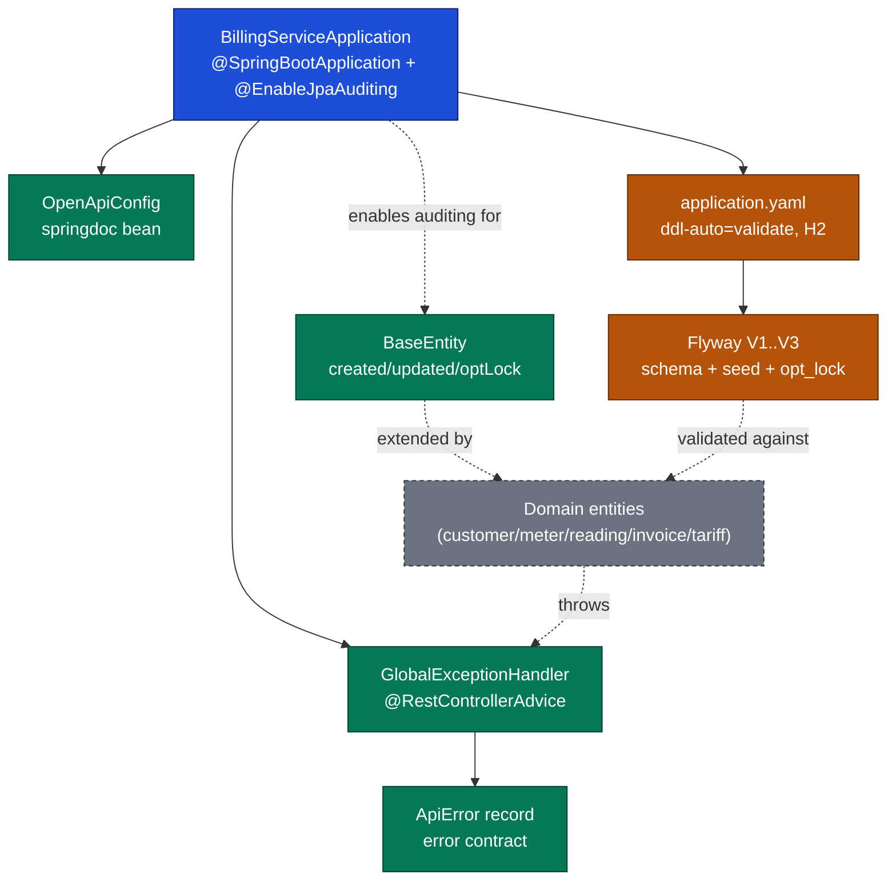

# EcoVolt Billing — Platform / Runtime Module Analysis

> Scope: cross-cutting **platform/runtime** concerns only — application bootstrap, shared
> persistence base, API documentation config, error contract, runtime configuration, database
> schema/migrations, and reliability tests. Domain behavior (customer, meter, reading, invoice,
> tariff) is referenced **only as named external dependencies**, never analyzed here.
> All claims cite `relative/path:line-range`. Facts are derived from source; assumptions are labeled.

## 1. Business Logic Overview
This module carries **no domain business logic by design**. It provides the platform substrate the
billing domains run on: consistent auditing, optimistic concurrency, uniform error responses, and a
validated schema. The only "rules" it owns are cross-cutting reliability invariants (see §6/§8).

## 2. Architecture Overview
- Spring Boot application, single deployable JAR. Entry point enables component scanning and JPA
  auditing globally (`billing-service/src/main/java/com/ecovolt/billing/BillingServiceApplication.java:7-13`).
- Runtime stack (supporting evidence, build manifest): Spring Boot `3.5.15`, Java toolchain `25`,
  starters for web, data-jpa, validation, actuator; Flyway for migrations; springdoc-openapi for
  docs; H2 at runtime; Lombok at compile-time
  (`billing-service/build.gradle:2-5,10-14,20-34`).
- Persistence model is **schema-first**: Flyway migrations own the DDL, while Hibernate is set to
  `validate` (never auto-generate), so entities must match the migrated schema
  (`billing-service/src/main/resources/application.yaml:11-14`).

## 3. Component Analysis
| Component | Responsibility | Evidence |
|---|---|---|
| `BillingServiceApplication` | Boot entry; enables auto-config + global JPA auditing | `.../BillingServiceApplication.java:7-13` |
| `common/BaseEntity` | `@MappedSuperclass` providing `createdAt`, `updatedAt`, `@Version optLock` | `.../common/BaseEntity.java:21-35` |
| `config/OpenApiConfig` | Declares OpenAPI metadata bean (title/version/contact/license) | `.../config/OpenApiConfig.java:11-23` |
| `exception/ApiError` | Immutable error payload (record) + factory overloads | `.../exception/ApiError.java:9-24` |
| `exception/BillingException` | Domain-rule violation → HTTP 422 | `.../exception/BillingException.java:7-11` |
| `exception/ResourceNotFoundException` | Missing entity → HTTP 404 | `.../exception/ResourceNotFoundException.java:6-14` |
| `exception/GlobalExceptionHandler` | Maps exceptions → `ApiError` + status; structured logging | `.../exception/GlobalExceptionHandler.java:18-68` |
| Flyway migrations V1–V3 | Baseline schema, seed tariffs, optimistic-lock columns | `.../db/migration/V1__*.sql`, `V2__*.sql`, `V3__*.sql` |
| `application.yaml` | Runtime config: datasource, H2 console, JPA validate | `.../application.yaml:1-14` |
| Reliability tests | Verify auditing, locking, conflict mapping, paging | `.../reliability/ReliabilityHardeningIntegrationTest.java:54-179` |

## 4. Interface Definitions (contracts owned by this module)
- **Error response contract** — every handled failure returns `ApiError`
  `{ timestamp, status, error, message, path, fieldErrors? }`
  (`.../exception/ApiError.java:9-16`). Status mapping:
  - `ResourceNotFoundException` → **404** (`GlobalExceptionHandler.java:22-25`)
  - `BillingException` → **422** (`:27-30`)
  - `MethodArgumentNotValidException` → **400** with per-field `fieldErrors` (`:32-45`)
  - `DataIntegrityViolationException` → **409**, generic constraint message (`:47-51`)
  - `Object/OptimisticLockingFailureException` → **409**, reload-and-retry message (`:53-57`)
  - any other `Exception` → **500**, generic message (`:59-63`)
- **Auditing/concurrency contract** — any entity extending `BaseEntity` gets auto-populated
  timestamps and a managed `@Version` column for optimistic locking
  (`common/BaseEntity.java:25-35`); auditing only works because it is enabled at app level
  (`BillingServiceApplication.java:5,8`).
- **API documentation contract** — single OpenAPI document titled "EcoVolt Utility Billing API",
  version `v1`, license "Proprietary" (`OpenApiConfig.java:18-22`).

## 5. Major Features
1. **Global, uniform error handling** with structured log events (`event=optimistic_lock_conflict`,
   `event=data_integrity_violation`, `event=unexpected_error`) for observability
   (`GlobalExceptionHandler.java:49,55,61`).
2. **Automatic JPA auditing** of create/update instants across all entities
   (`BaseEntity.java:25-31`; verified `ReliabilityHardeningIntegrationTest.java:54-67`).
3. **Optimistic concurrency** via `@Version` + per-table `opt_lock` columns
   (`BaseEntity.java:33-35`; `V3__add_optimistic_locking.sql:1-6`; verified `:69-89`).
4. **Schema-first migrations** with seeded reference tariffs (`V1`, `V2`, `V3`).
5. **Self-documenting API** through springdoc OpenAPI (`OpenApiConfig.java`).

## 6. Data Architecture / Contracts
- **Six tables** defined in baseline: `customers`, `meters`, `meter_readings`, `tariff_plans`,
  `tariff_slabs`, `invoices` (`V1__baseline_billing_schema.sql:1-88`). These belong to domain
  modules; platform interest is the **shared structural invariants**:
  - Uniqueness guarantees: `uk_customer_number`, `uk_meter_number`, `uk_reading_meter_date`,
    `uk_tariff_type_version`, `uk_invoice_number`, `uk_invoice_source_readings`
    (`V1:11,23,34,50,82,83`).
  - Referential integrity FKs link meters→customers, readings→meters, invoices→customers/readings/
    tariff_plan, slabs→plans (`V1:24,35,62,84-87`).
  - Indexes for read paths: `idx_reading_meter_date`, `idx_tariff_type_dates` (`V1:38,53`).
- **Auditing columns** `created_at`/`updated_at` exist on tables (`V1:9-10,21-22,...`), mapped by
  `BaseEntity` (`BaseEntity.java:26,30`).
- **`opt_lock`** added to all six tables with `NOT NULL DEFAULT 0` (`V3:1-6`), matching the
  non-null `optLock` field (`BaseEntity.java:34`).
- **Seed data** establishes three tariff types (RESIDENTIAL/COMMERCIAL/INDUSTRIAL) v1 with tiered
  slab rates (`V2:1-17`) — reference data, not transactional.

## 7. Integration Patterns
- **Spring `@RestControllerAdvice`** centralizes exception translation across all controllers
  (`GlobalExceptionHandler.java:18`), decoupling domain code from HTTP concerns.
- **Flyway-on-startup** applies versioned migrations; Hibernate `validate` ensures the ORM never
  diverges from the migrated schema (`application.yaml:11-14`).
- **JPA auditing listener** (`AuditingEntityListener`) wired via `@EntityListeners` on the shared
  superclass (`BaseEntity.java:22`) plus app-level `@EnableJpaAuditing`.
- **springdoc bean** integrates OpenAPI/Swagger UI through a single configuration bean
  (`OpenApiConfig.java:14-23`).

## 8. Quality Observations
- **Strong reliability coverage**: integration tests assert auditing population, stale-update
  rejection, 409 conflict mapping, DB uniqueness surfacing, and paged/scoped API metadata
  (`ReliabilityHardeningIntegrationTest.java:54-179`). A `standaloneSetup` probe controller proves
  the advice in isolation (`:94-108,237-248`).
- **Consistent observability**: warn/error logs carry event tags and request path but deliberately
  omit stack traces for client-facing 4xx (`GlobalExceptionHandler.java:49-50,55-56`).
- **Sensitive-data posture**: `application.yaml` contains **no secrets** — only an in-memory H2 URL
  and console toggle (`application.yaml:4-9`); nothing required masking.
- **Generic 500 path** intentionally hides internals from clients while logging full detail
  server-side (`GlobalExceptionHandler.java:59-63`) — intended behavior, not a swallowed error.

## 9. Engineering Insights
- The platform layer encodes reliability as **invariants enforced in two places** (entity `@Version`
  + DDL `opt_lock`), so concurrency safety holds even for direct SQL writers — a deliberate
  belt-and-suspenders choice (`BaseEntity.java:33-35` ↔ `V3:1-6`).
- **`ddl-auto: validate` + Flyway** is the keystone decision: schema authority lives in migrations,
  making the ORM a consumer, not a generator (`application.yaml:13`).
- Error taxonomy maps cleanly to HTTP semantics (404/422/400/409/500), giving clients a stable,
  predictable contract independent of which domain raised the failure.

## 10. Assumptions & Unknowns
- **Assumption**: build/runtime stack facts in §2 come from `build.gradle` (outside the explicit
  DO-list) and are cited as *supporting evidence* only; treated as external context, not deep
  analysis.
- **Assumption**: Flyway runs on startup — inferred from the `flyway-core` dependency
  (`build.gradle:25`) and presence of `db/migration/V1..V3`; no explicit Flyway config block exists
  in `application.yaml` (default-enabled behavior assumed).
- **Unknown**: production datasource — only an in-memory H2 dev profile is present
  (`application.yaml:4-5`); no prod/staging profile was found in scope.
- **Unknown**: actuator endpoints exposure — `spring-boot-starter-actuator` is declared
  (`build.gradle:21`) but no actuator configuration appears in scoped resources.
- **Out of scope (excluded)**: domain entity classes, repositories, controllers, and services for
  customer/meter/reading/invoice/tariff — referenced only as named dependencies above.
