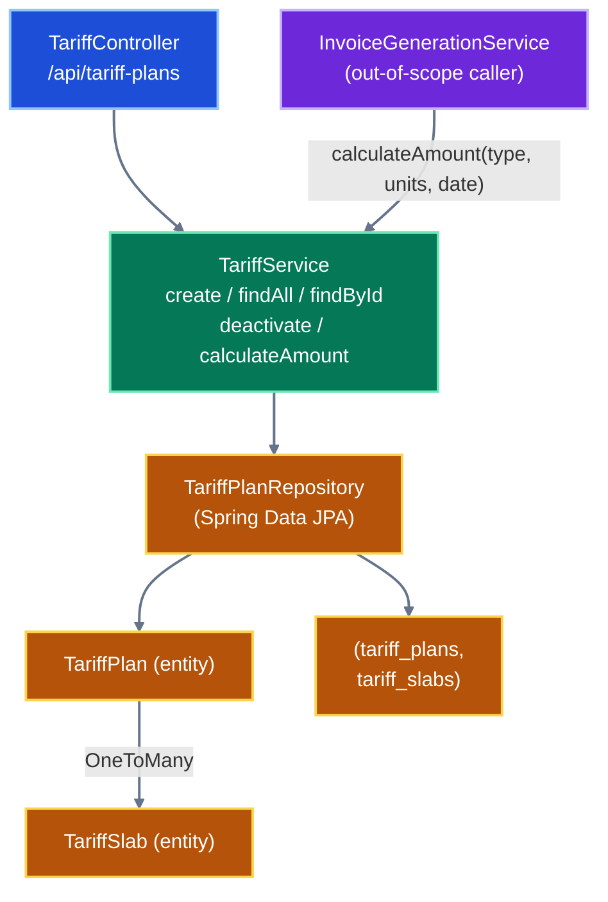

# Tariff Module Analysis

> Scope: `billing-service/src/main/java/com/ecovolt/billing/tariff/**`, `billing-service/src/main/resources/db/migration/V2__seed_default_tariff_plans.sql`, and tariff tests. Cross-module references are noted only where visible from tariff code. Invoice internals are out of scope.

## 1. Business Logic Overview

The tariff module owns **versioned, slab-based pricing** for electricity consumption. A `TariffPlan` belongs to one of three customer segments — `RESIDENTIAL`, `COMMERCIAL`, `INDUSTRIAL` (`TariffType.java:3-7`) — and carries an effective date window plus an ordered list of consumption `TariffSlab`s. Given units consumed and an invoice date, the module selects the active plan and computes a charge via progressive (tiered) slab pricing (`TariffService.java:85-124`).

Core domain rules (verified facts):
- **Progressive slab pricing**: each slab charges its rate only for units falling within its `[fromUnits, toUnits)` band; the last slab is open-ended (`TariffService.java:104-124`). Verified by test: 150 residential units → 500 + 350 = `850.00` (`TariffServiceIntegrationTest.java:29-37`; seed rates `V2__seed_default_tariff_plans.sql:9-11`).
- **Versioning**: `(type, version)` is unique (`TariffPlan.java:31`; `TariffService.java:35-38`).
- **No overlapping active windows** per type (`TariffService.java:43-45`; rejection test `TariffServiceIntegrationTest.java:39-47`).
- **Continuous slabs from 0.00**, only the last slab open-ended (`TariffService.java:126-153`; gap-rejection test `TariffServiceIntegrationTest.java:69-85`).

## 2. Architecture Overview

Standard Spring layered design: REST controller → service (transactional business logic) → Spring Data JPA repository → JPA entities, with request/response DTO records at the boundary.

## 3. Components and Subcomponents

| Component | File | Responsibility |
|---|---|---|
| `TariffController` | `TariffController.java:30-61` | REST endpoints under `/api/tariff-plans` |
| `TariffService` | `TariffService.java:24-168` | Validation, versioning, overlap checks, slab calculation |
| `TariffPlanRepository` | `TariffPlanRepository.java:10-35` | Existence, active-candidate, overlap queries |
| `TariffPlan` | `TariffPlan.java:37-75` | Aggregate root; owns slabs (cascade + orphan removal) |
| `TariffSlab` | `TariffSlab.java:28-53` | Consumption band + rate |
| `TariffType` | `TariffType.java:3-7` | Segment enum |
| `TariffCalculation` | `TariffCalculation.java:5-9` | Result record (amount + plan) |
| DTOs | `dto/*.java` | Request/response records with bean validation |

## 4. Interface Definitions (REST)

| Method | Path | Handler | Notes |
|---|---|---|---|
| POST | `/api/tariff-plans` | `create` → 201 | `@Valid TariffPlanRequest` (`TariffController.java:34-38`) |
| GET | `/api/tariff-plans` | `findAll` | Paginated, default size 20, sort `id` ASC (`TariffController.java:40-44`) |
| GET | `/api/tariff-plans/{id}` | `findById` | 404 via `ResourceNotFoundException` (`TariffService.java:99-102`) |
| PUT | `/api/tariff-plans/{id}/deactivate` | `deactivate` | Optional `effectiveTo` query param (`TariffController.java:52-60`) |

Internal interface: `calculateAmount(TariffType, BigDecimal unitsConsumed, LocalDate invoiceDate)` returns `TariffCalculation` (`TariffService.java:85-97`). Consumed by `InvoiceGenerationService` (`InvoiceGenerationService.java:80-81`, out-of-scope).

## 5. Data Contracts

- **`TariffPlanRequest`** (`dto/TariffPlanRequest.java:14-35`): `type` (NotNull), `version` (NotNull, Positive), `name` (NotBlank, ≤120), `effectiveFrom` (NotNull), `effectiveTo` (optional), `slabs` (NotEmpty, @Valid).
- **`TariffSlabRequest`** (`dto/TariffSlabRequest.java:8-20`): `fromUnits` (NotNull, ≥0.00), `toUnits` (optional, ≥0.01), `ratePerUnit` (NotNull, ≥0.01).
- **`TariffPlanResponse` / `TariffSlabResponse`** (`dto/TariffPlanResponse.java:9-31`, `dto/TariffSlabResponse.java:7-21`): full read projections including generated `id` and `sortOrder`.
- **Persistence**: monetary/unit fields `precision=12, scale=2` (`TariffSlab.java:37-44`); `tariff_type` stored as STRING enum, length 32 (`TariffPlan.java:43-45`).

## 6. Relationships

- `TariffPlan` 1—N `TariffSlab`, `OneToMany(mappedBy="tariffPlan", cascade=ALL, orphanRemoval=true)`, `@OrderBy("sortOrder ASC")` (`TariffPlan.java:63-66`); inverse `ManyToOne` non-optional FK `tariff_plan_id` (`TariffSlab.java:46-48`).
- `replaceSlabs` re-parents slabs and clears prior collection (`TariffPlan.java:68-74`).
- Cross-module (visible only): `Invoice` holds FK `tariff_plan_id` and denormalized `tariff_type`/`tariff_version` (`V1__baseline_billing_schema.sql:72-87`; `InvoiceResponse.java:20-22`).

## 7. Validation Rules

Two layers:
1. **Bean validation** at DTO boundary (Section 5).
2. **Service invariants** (`TariffService.validatePlan`, `TariffService.java:126-153`):
   - `effectiveTo` must be after `effectiveFrom` (`:127-129`).
   - Slabs must be continuous starting at `0.00` (`:139-141`).
   - Only the last slab may be open-ended (`:142-144`, `:150-152`).
   - `toUnits > fromUnits` per slab (`:145-147`).
   - Negative `unitsConsumed` rejected in calculation (`:87-89`).
   - Duplicate `(type, version)` rejected (`:35-38`); active overlap rejected (`:43-45`).

## 8. State / Lifecycle Behavior

`TariffPlan` is an implicit state machine over `active` + `effectiveTo`:
- **Created active**: `active=true`, `effectiveTo` defaults to open-ended sentinel `9999-12-31` for overlap checks (`TariffService.java:27,40-42,47-54`).
- **Deactivated**: `active=false`, `effectiveTo` closed to provided date or `now()` (`TariffService.java:72-83`); test confirms window close (`TariffControllerIntegrationTest.java:62-74`).
- **Active selection** for billing: `findActiveCandidates` filters `active=true AND effectiveFrom<=date AND (effectiveTo IS NULL OR effectiveTo>date)`, ordered `version DESC`, first match wins (`TariffPlanRepository.java:14-22`; `TariffService.java:91-93`).

Versioning lifecycle is verified: closing a prior version then creating v2 makes v2 the active plan (`TariffServiceIntegrationTest.java:49-67`).

## 9. Integration Patterns

- **Inbound**: REST via Spring MVC; OpenAPI annotations present (`TariffController.java:29,35,41,47,53`).
- **Outbound consumption**: synchronous in-process call from invoice generation (`InvoiceGenerationService.java:80-81`), passing meter's `tariffType`.
- **Persistence**: Spring Data JPA with JPQL queries; Flyway seed data establishes v1 plans + 3 slabs each per type (`V2__seed_default_tariff_plans.sql:1-17`).
- **Observability**: structured `log.info` events `tariff_plan_created` / `tariff_plan_deactivated` (`TariffService.java:57-58,80-81`).
- **Concurrency**: optimistic locking via `opt_lock` (`V3__add_optimistic_locking.sql:4-5`).

## 10. Quality Observations

- Slab rounding is `HALF_UP` to scale 2 (`TariffService.java:123`); per-slab sums kept full precision until final scaling.
- Calculation re-sorts slabs by `sortOrder` defensively even though `@OrderBy` already orders them (`TariffService.java:106`).
- Tests cover pricing, overlap rejection, versioning succession, gap rejection, and all 4 endpoints (`TariffServiceIntegrationTest.java`, `TariffControllerIntegrationTest.java`).
- HTTP status mapping (422 for `BillingException`, 404 for `ResourceNotFoundException`) is asserted in tests but defined outside this module's scope (exception handler not in tariff package).

## 11. Engineering Insights & Anomalies

- **Anomaly — duplicated optimistic-lock fields**: `TariffPlan` extends `BaseEntity`, which already declares `@Version opt_lock` plus auditing fields (`BaseEntity.java:23-36`). `TariffSlab` does **not** extend `BaseEntity` but declares its own `@Version opt_lock` (`TariffSlab.java:50-52`), so slabs have optimistic locking but **no `created_at`/`updated_at` auditing**. This asymmetry is a finding, not necessarily intended.
- **Open-ended sentinel vs NULL**: overlap logic substitutes `9999-12-31` when `effectiveTo` is null (`TariffService.java:40-42`), but the stored entity keeps `effectiveTo=null` (`TariffService.java:52`) and queries also handle `effectiveTo IS NULL` (`TariffPlanRepository.java:19`). Two null-representations coexist; behavior is consistent but worth noting.
- **First-match active selection**: overlap prevention is the guard that keeps `findActiveCandidates` effectively single-result; `version DESC` ordering is a safety tiebreaker (`TariffPlanRepository.java:21`).
- **Deactivate boundary check** duplicates the create-time `effectiveTo > effectiveFrom` rule (`TariffService.java:75-77` vs `:127-129`) — scattered same rule.

## 12. Assumptions & Unknowns

- HTTP→status mapping (422/404) is **assumed** from test expectations; the mapping class lives outside the tariff package (not inspected — out of scope).
- `BillingException` / `ResourceNotFoundException` semantics taken from import usage only (`TariffService.java:3-4`); their definitions were not analyzed.
- Whether `TariffSlab` lacking auditing is intentional is **unknown** (requires owner confirmation).
- Invoice-side consumption shown for relationship context only; invoice internals not analyzed per scope.
