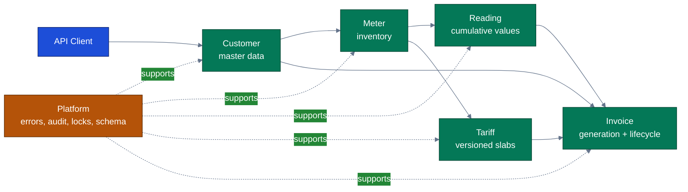
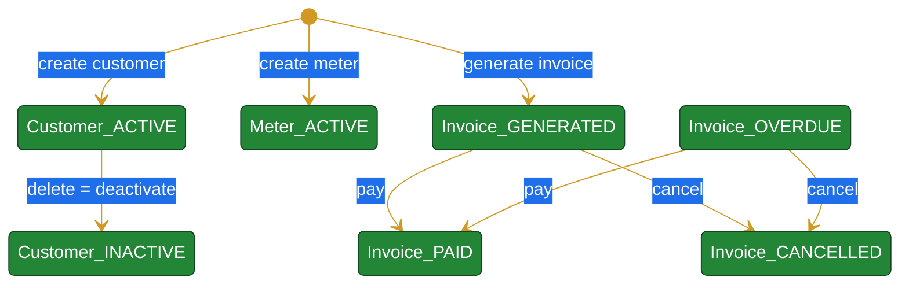

# EcoVolt Billing Service Analysis Summary

> Scope: whole `billing-service`, analyzed through five bounded module artifacts:
> platform/runtime, customer, meter/reading, tariff, and invoice. This summary consolidates
> verified module findings and preserves assumptions/unknowns instead of converting them into
> requirements.

## 1. Executive TLDR

EcoVolt Billing is a single Spring Boot billing service that manages customer accounts, meter
inventory, cumulative meter readings, versioned slab tariffs, and invoice generation/lifecycle.
The dominant business flow is: onboard a customer, attach meters, capture monotonic readings,
select the active tariff for the meter type, generate invoices from the latest eligible reading
pair, and move invoices through payment/cancellation states.

The service is strongest where domain invariants are explicit and double-guarded: soft customer
deactivation preserves financial history (`module-customer.md:15-23`), readings are monotonic and
unique per meter/date (`module-meter-reading.md:17-24,106-111`), tariffs prevent overlapping
effective windows and invalid slabs (`module-tariff.md:9-14,82-90`), invoice source-reading pairs
are deduplicated in code and schema (`module-invoice.md:13-20,147-153`), and platform-level
optimistic locking/error mapping provides consistent reliability semantics
(`module-platform.md:66-92,121-131`).

## 2. System Architecture

The system uses a layered Spring Boot structure: REST controllers, transactional services,
Spring Data JPA repositories, JPA entities, DTO records, Flyway migrations, and global exception
translation. Platform configuration makes migrations the schema authority and uses Hibernate only
for validation (`module-platform.md:21-23,111-119`).

## 3. Core Domain Model

| Domain area | Primary responsibility | Key rules |
|---|---|---|
| Customer | System-of-record for billed accounts | Created `ACTIVE`; generated `CUST-` number; delete means deactivate, not remove (`module-customer.md:15-23,110-126`). |
| Meter | Physical meter registration | Unique meter number; active on create; default tariff type is residential when omitted (`module-meter-reading.md:12-20,101-105`). |
| Reading | Cumulative consumption records | Unique per meter/date; value cannot violate nearest earlier/later readings (`module-meter-reading.md:17-24,106-111`). |
| Tariff | Segment-specific slab pricing | Type/version uniqueness, non-overlap, continuous slabs from zero, progressive charge calculation (`module-tariff.md:7-14,92-99`). |
| Invoice | Billing and payment lifecycle | Latest two readings per meter produce consumption; duplicate pairs skipped/rejected; only generated/overdue invoices can be paid/cancelled (`module-invoice.md:9-20,114-135`). |
| Platform | Cross-cutting reliability | Uniform `ApiError`, auditing, optimistic locking, schema-first migrations (`module-platform.md:66-92,94-119`). |

## 4. End-to-End Billing Flow

1. A customer is created with system-generated identity and `ACTIVE` status
   (`module-customer.md:15-19`).
2. A meter is registered for that customer, with an installation date, tariff type, and `ACTIVE`
   status (`module-meter-reading.md:12-16,101-105`).
3. Meter readings are captured as cumulative values, with duplicate-date and monotonicity guards
   (`module-meter-reading.md:106-111`).
4. Invoice generation selects customer meters, fetches the latest two readings for each meter,
   computes consumption, rejects negative consumption, and skips already invoiced reading pairs
   (`module-invoice.md:9-20,101-112`).
5. Tariff calculation selects the active plan for the meter tariff type and invoice date, applies
   progressive slabs, and returns amount plus plan snapshot (`module-tariff.md:92-105`;
   `module-invoice.md:85-91,95-99`).
6. The invoice stores immutable source readings, amount, tariff snapshot, and starts in `GENERATED`
   status (`module-invoice.md:85-99,114-119`).

## 5. State Machines and Lifecycle Gaps

Verified lifecycle gaps are important analysis outputs, not new requirements:

- Customer declares `SUSPENDED`, but no in-scope transition assigns it
  (`module-customer.md:124-150`).
- Meter declares `INACTIVE`, `FAULTY`, and `DECOMMISSIONED`, but no in-scope transition moves a
  meter away from `ACTIVE` (`module-meter-reading.md:119-130,180-190`).
- Invoice allows `OVERDUE` as a source state for pay/cancel, but no in-scope code sets it
  (`module-invoice.md:114-135,171-176`).
- Tariff slabs use optimistic locking but do not inherit common auditing, unlike tariff plans
  (`module-tariff.md:116-128`).

## 6. API and Error Contract

The public API is organized around `/api/customers`, `/api/meters`, `/api/readings`,
`/api/tariff-plans`, and `/api/invoices`, with consistent paginated list endpoints and create/read
operations per module (`module-customer.md:63-78`; `module-meter-reading.md:64-77`;
`module-tariff.md:56-65`; `module-invoice.md:67-81`).

Cross-cutting errors are normalized to `ApiError` with status mappings for not found, business
validation, bean validation, data conflicts, optimistic-lock conflicts, and unexpected failures
(`module-platform.md:66-81`). Domain modules rely on this by throwing `BillingException` for
business-rule violations and `ResourceNotFoundException` for missing records
(`module-meter-reading.md:113-117`; `module-invoice.md:77-81`).

## 7. Data and Reliability Invariants

- Flyway defines baseline tables for customers, meters, readings, tariff plans/slabs, and invoices,
  and Hibernate validates rather than generates schema (`module-platform.md:21-23,94-109`).
- `created_at`, `updated_at`, and `opt_lock` are shared across main entities through the platform
  base entity/migrations (`module-platform.md:76-90,104-107`).
- Unique constraints protect customer numbers, meter numbers, readings per meter/date, tariff
  type/version, invoice numbers, and source-reading pairs (`module-platform.md:95-103`).
- Application-level checks usually mirror database constraints, creating defense in depth for
  collisions or concurrent requests (`module-customer.md:103-108`;
  `module-meter-reading.md:132-140,164-168`; `module-invoice.md:147-153`).

## 8. Quality and Test Coverage Snapshot

The best-tested areas are invoice generation/lifecycle and tariff pricing/versioning, which include
unit and integration tests for the principal business rules (`module-invoice.md:156-159`;
`module-tariff.md:109-114`). Reading validation has focused unit coverage for duplicate,
lower-than-previous, higher-than-next, and valid monotonic cases (`module-meter-reading.md:156-161`).
Customer coverage is thinner and mainly pins soft deletion/retention (`module-customer.md:134-139`).
Platform reliability tests cover auditing, optimistic locking, 409 conflict mapping, uniqueness
surfacing, and pagination/scoping metadata (`module-platform.md:121-125`).

## 9. Assumptions and Unknowns

1. Production datasource/runtime profile is unknown; scoped resources show only in-memory H2
   configuration (`module-platform.md:142-152`).
2. Unused lifecycle enum values may be future states, externally managed states, or dead values; no
   conclusion should be made without owner confirmation (`module-customer.md:146-151`;
   `module-meter-reading.md:180-190`; `module-invoice.md:171-176`).
3. Some repository methods appear designed for cross-module consumers; their reachability is only
   fully confirmed in module contexts where callers are in scope (`module-meter-reading.md:79-82`;
   `module-invoice.md:139-145`).
4. No authentication/authorization behavior was identified in the analysis artifacts; absence here
   means "not found in analyzed scope," not "not required."

## 10. Analysis Confidence

Confidence: **0.86**.

Basis: all module artifacts cite concrete source/test lines and the summary uses those artifacts as
inputs. Caveats: several source files outside individual module scopes were referenced only to
ground cross-module contracts; lifecycle gaps require owner/stakeholder confirmation before being
treated as intentional product behavior.

